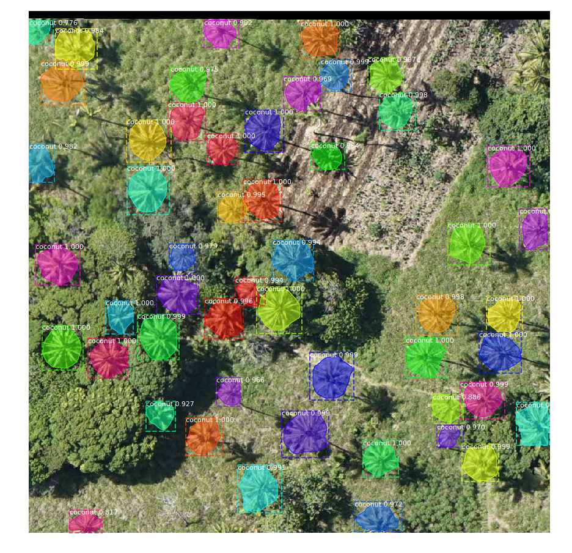

Coconut Trees Detection and Segmentation
========================================
This repo provided supplementary material for our paper **Coconut Trees Detection and Segmentationin Aerial Imagery using Mask R-CNN** - submitted to IET Computer Vision.

The following images are provided as a sample output on the coconut trees detection task. 
The repository will be updated and necessary code will be provided to the user for their own tasks on trees detection.
The work in this repo borrows the Mask R-CNN code from https://github.com/matterport/Mask_RCNN

The output images are placed in `detection` and `segmentation` folders. 

## Youtube demo
Click on the image to play in youtube

## Note
Use of the images in this repo is not allowed without permission. 

